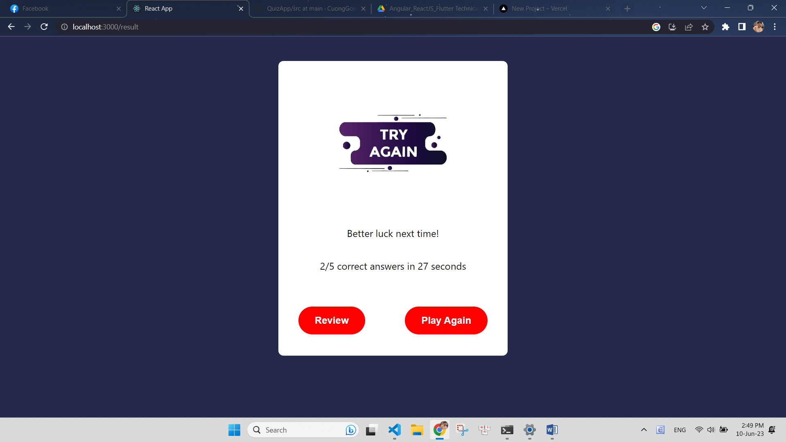
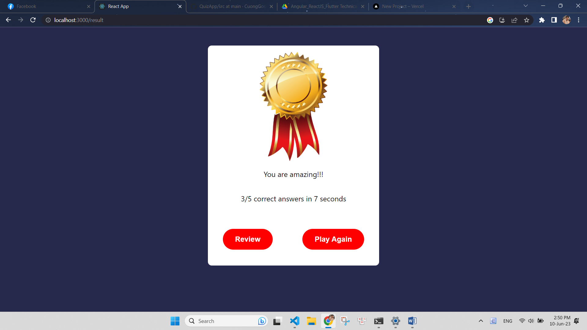
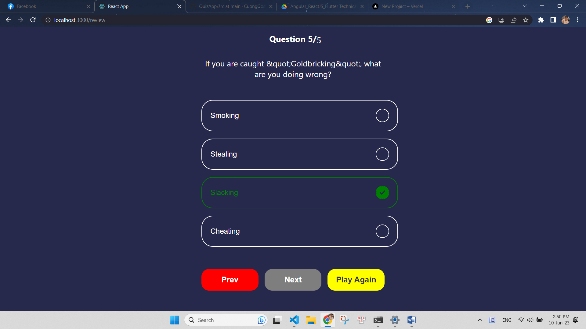

# Project Introduction:

This is a React.js quiz application that allows users to test their knowledge by answering a series of questions. The app provides interactive features and displays statistics at the end of the quiz.

## IMAGE DEMO WEBSITE:

#### Giao diện chính của trang web trên thiết bị pc,laptop

### DEMO WEBSITE:

## LINK DEMO WEBSITE:

A demo of the website can be found at the following link: https://quiz-app-cuonggosu.vercel.app

## Technologies in use:

This project was developed using the following technologies:

- SCSS
- REACTJS

## FEATURE:

#### The website includes the following features:

- The website also supports rendering products from an API (https://opentdb.com/api.php?amount=5)
- Answer Validation: After selecting an answer, the app validates the selection and provides feedback indicating if the chosen answer is correct or incorrect.
- Quiz Statistics:

  "Total Time": The app records the time taken by the user to complete the quiz and displays it in a user-friendly format.
  "Correct Answers": The number of correct answers provided by the user during the quiz is shown.
  "Pass/Fail": A clear message indicates if the user passed or failed the quiz based on predefined passing criteria.

- Review Answers: After completing the quiz, users have the option to review their answers. They can see the correct answers for the questions they answered incorrectly.
- Replay: Once the quiz is completed, users can choose to replay the quiz the app.

## Installation:

To install this project, simply clone the GitHub repository:

git clone https://github.com/CuongGosu/QuizApp.git
